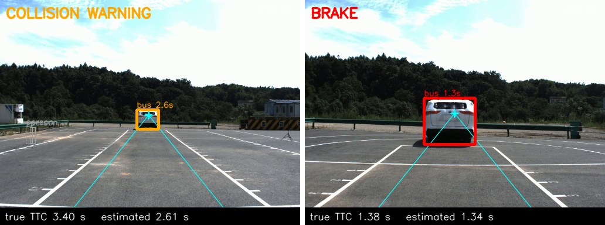
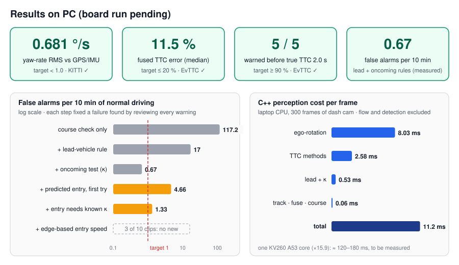
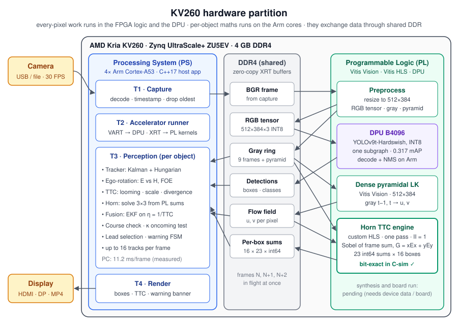
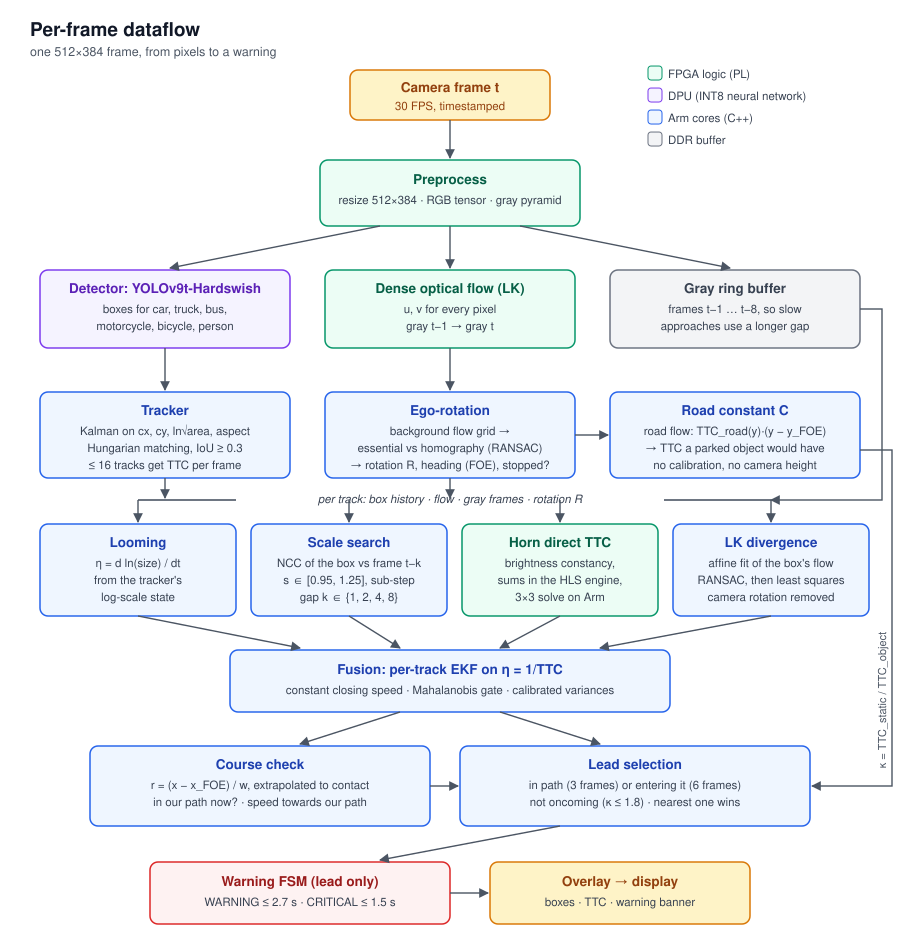
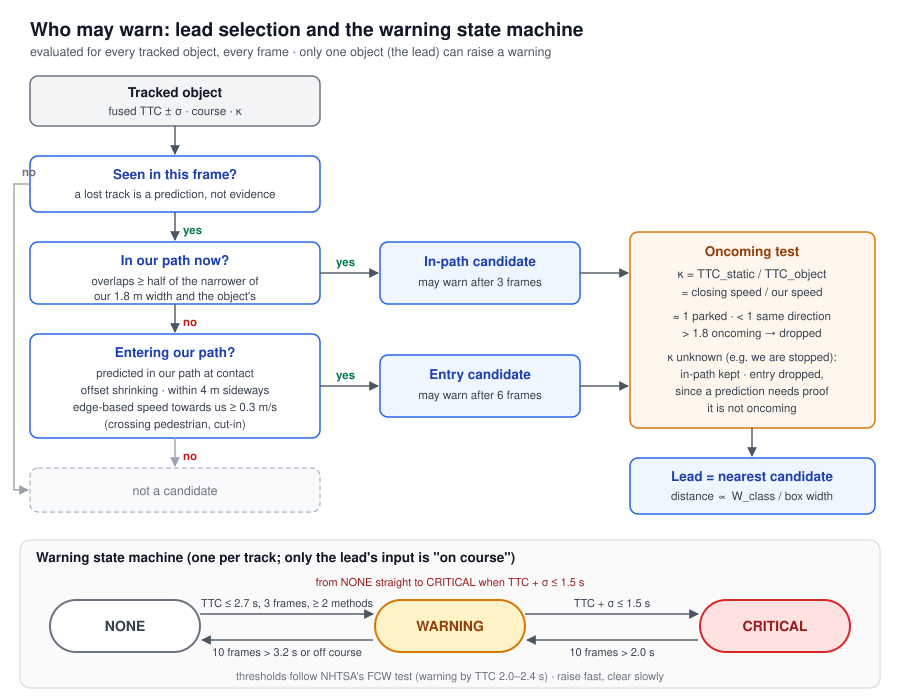
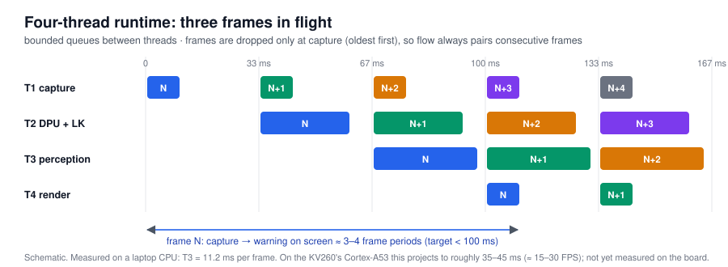
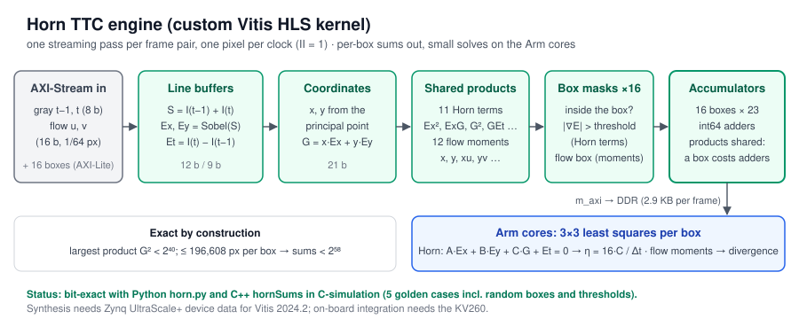
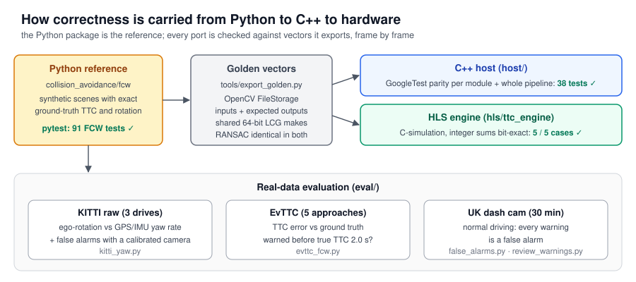
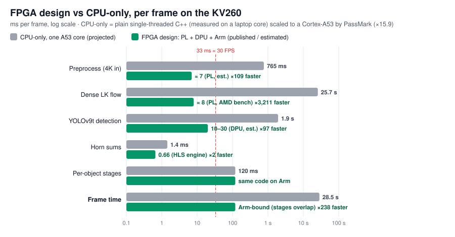

# Monocular Forward-Collision Warning on the AMD Kria KV260

**One camera. No radar, no lidar, no speed signal.** This project estimates, for every road user in front of the vehicle, *how many seconds remain until impact* (time to collision, TTC), decides which one is actually in our way, and warns the driver in time. It does this with optical flow and image geometry rather than distance measurements, and it is built to run on an AMD Kria KV260: per-pixel work goes to the FPGA fabric and the DPU, per-object reasoning to the Arm cores.

<p align="center">
  
  <br/>
  <sub>Real footage from the EvTTC dataset (a test car approached at constant speed). Left: the first WARNING, at true TTC 3.40 s (estimated 2.61 s). Right: CRITICAL ("BRAKE") at true TTC 1.38 s, estimated 1.34 s. Cyan: our heading and driving corridor. YOLOv9t labels the test car "bus"; the class only sets a width prior.</sub>
</p>

---

## Contents

1. [Results at a glance](#results-at-a-glance)
2. [The problem, and why it is hard with one camera](#the-problem-and-why-it-is-hard-with-one-camera)
3. [System architecture on the KV260](#system-architecture-on-the-kv260)
4. [Per-frame dataflow](#per-frame-dataflow)
5. [How each stage works](#how-each-stage-works)
6. [Who is allowed to warn: lead selection](#who-is-allowed-to-warn-lead-selection)
7. [Four-thread runtime](#four-thread-runtime)
8. [The custom HLS engine](#the-custom-hls-engine)
9. [How correctness is verified](#how-correctness-is-verified)
10. [Results in detail](#results-in-detail)
11. [Repository structure](#repository-structure)
12. [Getting started](#getting-started)
13. [Status and roadmap](#status-and-roadmap)
14. [Earlier pipeline (2025)](#earlier-pipeline-2025)
15. [Contributors and acknowledgments](#contributors-and-acknowledgments)

---

## Results at a glance

<p align="center"></p>

| What | Target | Measured | |
|---|---|---|---|
| Camera rotation (yaw rate) vs KITTI GPS/IMU | < 1.0 °/s RMS | **0.681 °/s** (805 frame pairs, 3 drives) | ✅ |
| Fused TTC error, real approaches (EvTTC) | ≤ 20 % median | **11.5 %** | ✅ |
| Approaches warned before true TTC 2.0 s (EvTTC) | ≥ 90 % | **100 %** (5 of 5) | ✅ |
| False alarms in normal driving (30 min dash cam) | < 1 per 10 min | **0.67 per 10 min** (2 in 30 min) with the lead-vehicle and oncoming rules. The newest version (adds predicted path entry) was re-checked on 3 of the 10 clips: 1 warning, the same one the earlier version raised | ✅ / partial |
| Crossing pedestrian / car cutting in (synthetic road) | warn by TTC 1.5 s | **warns at ≈ 2.3 s** (was 0.80 s / 0.86 s) | ✅ |
| Perception cost, C++ on a laptop CPU | — | **7.5–11.2 ms per frame** | |
| Same work on one KV260 Cortex-A53 core (×15.9, PassMark) | 33 ms for 30 FPS | ≈ 120–180 ms → ≈ 6–8 FPS until spread over the 4 cores or moved to the PL | ⏳ board run pending |
| **Whole system: FPGA design vs CPU-only (A53)** | — | **≈ 0.12–0.18 s vs 28.5 s per frame: ≈ 160–240× faster, ≈ 80–180× less energy per frame** (estimated, see [FPGA design vs CPU-only vs GPU](#fpga-design-vs-cpu-only-vs-gpu)) | |
| **Whole system: FPGA design vs native GPU (RTX 4060 Laptop, measured)** | — | **≈ 0.12 s vs 0.245 s per frame (≈ 2×; ≈ 7× with 4 Arm cores), 10–15 W vs 47.7 W, ≈ 4–23× less energy per frame** | |
| Horn engine, HLS C-simulation vs software | bit-exact | **5 / 5 cases bit-exact** | ✅ |
| Python ↔ C++ parity | identical decisions | **38 / 38 GoogleTest parity tests** | ✅ |

Everything above is measured on a PC. **The KV260 board run has not happened yet** (see [Status](#status-and-roadmap)).

---

## The problem, and why it is hard with one camera

A forward-collision warning (FCW) system has to answer two questions, many times per second:

1. **When would we hit it?** Time to collision, TTC = distance / closing speed.
2. **Would we hit it at all?** Is the object in our path, or about to be?

With a single camera neither distance nor speed is observable directly. But TTC *is*: an object's image grows at a rate set only by its TTC, regardless of its size or distance. If an object's image is `s` pixels wide and grows at `ds/dt`, then

$$\mathrm{TTC} = \frac{s}{ds/dt} \qquad\text{or equivalently}\qquad \eta = \frac{1}{\mathrm{TTC}} = \frac{d \ln s}{dt}.$$

Everything in this system builds on that: four independent ways to measure image expansion, a filter that fuses them, and geometry that decides which object matters. The hard parts are the ones real roads add:

| Difficulty | What goes wrong | How it is handled |
|---|---|---|
| **Our own rotation** | turning or pitching makes everything appear to move; flow divergence picks up a bias | camera rotation is estimated from background flow every frame and removed exactly |
| **Parked and oncoming cars** | on narrow streets they have genuinely short TTCs, a metre beside our path | only the *lead* object may warn; oncoming traffic is recognised from the road's own flow (κ) |
| **Crossing pedestrians, cut-ins** | they only overlap our path just before contact, too late to wait for | predicted path entry, measured from the box's outer edge |
| **Vehicles beside us** | their visible side panel widens the box towards us, faking a cut-in | the entry speed uses the rear face's outer edge and the box height, which the side panel cannot move, against a fixed reference with our rotation removed |
| **No calibration on the road** | camera height, speed, horizon unknown | the road-plane constant C and the ratio κ need none of them |
| **Real-time on an embedded board** | dense flow and a CNN at 30 FPS will not fit on four A53 cores | every-pixel work goes to the FPGA logic and the DPU |

---

## System architecture on the KV260

<p align="center"></p>

**Placement rule.** Work that touches *every pixel of every frame* goes to the Programmable Logic (PL) or the DPU. Work that scales with *the number of objects* stays on the Arm cores. All exchange happens through shared, zero-copy XRT buffers in DDR, so no frame is copied between the two sides.

| Where | Component | Why there |
|---|---|---|
| PL · Vitis Vision | Preprocess: resize to 512×384, RGB tensor for the DPU, gray image and pyramid | per-pixel, streaming |
| PL · DPU B4096 | YOLOv9t with Hardswish activations, INT8, compiled as **one** DPU subgraph | a CNN; SiLU had to be replaced for the whole network to map onto the DPU |
| PL · Vitis Vision | Dense pyramidal Lucas–Kanade optical flow, 512×384 | per-pixel, iterative; the main reason flow is real-time at all |
| PL · custom HLS | **Horn TTC engine**: 23 integer sums per box for up to 16 boxes in one pass | per-pixel products and accumulations; bit-exact with the software model |
| PS · T1 | Capture, decode, timestamp | I/O |
| PS · T2 | Accelerator runner: VART for the DPU, XRT for PL kernels | keeps the accelerators fed |
| PS · T3 | Tracking, ego-rotation, TTC methods, fusion, course check, lead selection, warning FSM | per-object logic with branches, RANSAC and small matrix solves |
| PS · T4 | Overlay and output | display |

Why not a learned optical-flow network (RAFT, PWC-Net) on the DPU? They rely on cost volumes, warping and iterative refinement that the DPU cannot run; in the [earlier pipeline](#earlier-pipeline-2025) PWC-Net compiled only with its correlation and warping on the CPU, and its INT8 version lost too much accuracy for TTC. Vitis Vision LK is native to the fabric, and the TTC methods here are designed to work with it.

---

## Per-frame dataflow

<p align="center"></p>

One frame flows top to bottom. Detection and flow run in parallel on the accelerators; everything below the tracker runs per object on the Arm cores (at most 16 objects per frame, chosen by priority: on-course objects first, then the largest).

---

## How each stage works

### 1. Detection: YOLOv9t-Hardswish on the DPU
YOLOv9t with SiLU replaced by Hardswish compiles to a single DPU subgraph (0.317 COCO mAP50-95 INT8 vs 0.378 for the float original). Only the six collision-relevant classes are kept: car, truck, bus, motorcycle, bicycle, person. Decode and NMS run on the Arm cores. On the PC the same model runs in PyTorch.

### 2. Dense optical flow: pyramidal Lucas–Kanade
Flow between consecutive gray frames, per pixel. On the board it is the Vitis Vision `densePyrOpticalFlow` kernel; on the PC, OpenCV's DIS flow stands in for it. Every flow consumer in this project works with plain per-pixel `(u, v)`, so the source is interchangeable.

### 3. Tracking: a Kalman filter in log-scale
Each object's state is `[cx, cy, σ = ln√(w·h), aspect, ċx, ċy, σ̇]`. Tracking the *logarithm* of the size makes `σ̇` directly the looming rate η, the first TTC estimate. Detections are associated with an IoU cost and the Hungarian algorithm (IoU ≥ 0.3); a track survives 30 frames without a detection, but a frame without one never counts as evidence for a warning.

### 4. Ego-rotation: removing our own turning
Translation towards the object *is* the collision signal and must be kept; rotation is pure nuisance and must go. Background flow is sampled on a grid (avoiding tracked objects) and two models are fitted with RANSAC:

- an **essential matrix** (we moved: gives rotation `R` and the direction of travel, whose image is the **focus of expansion, FOE**);
- a **homography** (we only rotated, e.g. stopped at a light: the essential matrix is degenerate then).

Model selection picks the right one, flags "stopped", and the FOE is smoothed over about 0.7 s. RANSAC is capped at 200 iterations and pose recovery uses 64 well-spread inliers, which made this stage 2–5× faster with no loss of accuracy (yaw-rate RMS 0.681 °/s against KITTI's GPS/IMU).

### 5. Four independent TTC measurements
Each method outputs `η = 1/TTC` (in s⁻¹) with its own variance. They fail in different situations, which is why there are four.

| Method | Idea | Strong when | Weak when |
|---|---|---|---|
| **Looming** | `η = dσ/dt` from the tracker's log-size | always available | box jitter on small objects |
| **Scale search** | find the scale `s*` that best maps the box in frame `t−k` onto frame `t` (zero-mean NCC over `s ∈ [0.95, 1.25]`, coarse-to-fine with a parabolic peak); `TTC = kΔt / (s* − 1)`. The gap `k ∈ {1, 2, 4, 8}` adapts so the expansion is measurable | textured targets, slow approaches | low texture |
| **Horn direct TTC** | brightness constancy for an approaching plane: `A·Ex + B·Ey + C·G + Et = 0` with `G = x·Ex + y·Ey`; `C` is the inverse TTC. Solved by least squares from per-box sums. This is the stage the **HLS engine** computes | no flow or matching needed | large motion between frames |
| **LK divergence** | fit an affine flow field `u = a₀ + a₁x + a₂y`, `v = b₀ + b₁x + b₂y` to the box (RANSAC, then least squares); `η = (a₁ + b₂) / 2Δt` after subtracting the divergence our rotation causes, computed exactly from `H = K R K⁻¹` | most accurate on real footage (9.5 % median error alone) | occasional large outliers |

### 6. Fusion: one filter per object
An extended Kalman filter on η with a constant-closing-speed model:

$$\eta_{t+\Delta t} = \frac{\eta_t}{1 - \eta_t\,\Delta t}$$

Each available measurement updates it with its variance, scaled by a per-method factor **calibrated on real approaches** (looming 0.19, scale 6.61, Horn 68.1, divergence 1013; divergence's own variance is far too optimistic on its bad frames) and floored to cover model error. A Mahalanobis gate rejects outliers; after five frames of rejections the filter restarts. A track whose measurements have gone stale reports *no* TTC rather than a prediction.

### 7. Course check: where is the object relative to our path?
The heading is the smoothed FOE `x_F`. The lateral offset in object widths

$$r = \frac{x_c - x_F}{w} = \frac{X}{W_{obj}}$$

does not depend on distance (both numerator and width scale with `1/Z`). With a class width prior (car 1.8 m, truck/bus 2.5 m, motorcycle 0.8 m, bicycle 0.6 m, person 0.5 m) it becomes metres. Two tests use it:

- **in our path now**: the object's lateral extent overlaps our 1.8 m width by at least half of the narrower of the two;
- **predicted at contact**: `r` is extrapolated with its rate over the last 0.5 s, `r + ṙ·TTC`.

### 8. Closing-speed ratio κ: is it oncoming?
On a flat road, with rotation removed, a road pixel at image row `y` has a TTC proportional to its depth, and depth is proportional to `1/(y − y_FOE)`. So

$$C = \mathrm{TTC}_{road}(y)\cdot(y - y_{FOE})$$

is **the same for every road pixel**: our speed over the camera height, in image terms. It is measured where road flow is large and reliable, and needs no calibration. It gives the TTC that a *parked* object would have at the object's contact row, and

$$\kappa = \frac{\mathrm{TTC}_{static}}{\mathrm{TTC}_{object}} = \frac{\text{closing speed}}{\text{our speed}}$$

reads about 1 for parked objects, below 1 for traffic going our way, and well above 1 for oncoming traffic (synthetic check: 0.95 / 2.37 / 0.47 for true 1.0 / 2.5 / 0.5). Objects with κ > 1.8 are oncoming and never the lead.

### 9. Entry speed: is it really moving into our path?
A long vehicle beside us shows more of its side as we close in. Its box widens *towards* our path and its centre drifts inwards with no lateral motion at all; that faked cut-ins on real footage. The rear face's **outer edge** and the **box height** are immune (the side panel is farther away, so it is never taller than the rear face and lies inside the outer edge). So

$$q = \frac{x_{outer} - x_F}{h} = \frac{X_{outer}}{H_{obj}}$$

changes only with real lateral motion, and `dq/dt · H_obj` (class height prior: car 1.5 m, truck/bus 3.0 m, person 1.7 m) is the speed at which the object nears our path. Two further details came from real footage:

- **`x_ref` is fixed** (the principal point), not the heading. When a lorry fills half the image the background disappears, the FOE estimate jumps by tens of pixels, and every jump would read as lateral motion of ±2–3 m/s.
- **Our own turning is removed**: each frame's rotation-only image shift at the edge, from `H = K R K⁻¹`, is accumulated and subtracted, so a bend does not look like the world sliding sideways.

Boxes cut off by the image border are excluded.

### 10. Warning state machine
One per track, with NHTSA's FCW test as the anchor (warning by TTC 2.0–2.4 s). See the next section for who is allowed to feed it.

---

## Who is allowed to warn: lead selection

<p align="center"></p>

Getting TTC right was not the hard part. Real streets are full of objects with genuinely short TTCs that we will *not* hit: parked cars on narrow residential roads, oncoming cars in the other lane, a lorry we are overtaking. The first version, which warned for anything "on a collision course", raised **117 false alarms per 10 minutes** of ordinary driving. Each rule in this diagram exists because of a specific failure found by reviewing every warning frame:

| Rule | Failure it fixed | False alarms per 10 min |
|---|---|---|
| warn for anything predicted on course | (baseline) | 117.2 |
| only the **lead**: nearest object overlapping half our width, 3 frames | parked cars passed with 0.5–1 m clearance | 17.0 |
| exclude **oncoming** traffic (κ > 1.8) | oncoming cars straight ahead on narrow streets | 0.67 |
| allow **predicted entry** (6 frames, ≥ 0.3 m/s, ≤ 4 m) | crossing pedestrians and cut-ins warned only 0.4–0.9 s before impact | 4.66 at first |
| entry needs a **known κ** | oncoming car drifting inwards while we were stopped (no road flow, κ unknown) | 1.33 |
| entry speed from the **outer edge / height**, against a **fixed reference** with **rotation removed** | a lorry's side panel, and the heading jumping while it hid the background, faking a cut-in as we overtook it | partial re-check: 3 of 10 clips, no new warnings |

The warning timing on real approaches stayed at 5 of 5 warned in time through every step.

---

## Four-thread runtime

<p align="center"></p>

`host/src/runtime/runtime.cpp` runs four threads connected by bounded queues: **T1** capture, **T2** accelerators (DPU detection and LK flow), **T3** perception (the whole per-object pipeline), **T4** render. While frame N is in perception, N+1 is on the accelerators and N+2 is being captured. Frames are dropped only at capture, oldest first, and only for live sources: flow pairs consecutive frames, so dropping anywhere later would pair flow with the wrong previous frame.

---

## The custom HLS engine

<p align="center"></p>

`hls/ttc_engine` is a Vitis HLS kernel that streams one frame pair through the fabric at one pixel per clock and produces, for up to 16 boxes, everything the Arm cores need for two of the four TTC methods:

- **11 Horn terms**: `ΣEx², ΣExEy, ΣExG, ΣEy², ΣEyG, ΣG², ΣExEt, ΣEyEt, ΣGEt, ΣEt²` and the pixel count, where `Ex, Ey` are the Sobel derivatives of the frame *sum* `S = I(t−1) + I(t)` (16× the mean-intensity derivative, all integer) and `Et = I(t) − I(t−1)`;
- **12 flow moments**: `n, Σx, Σy, Σx², Σxy, Σy², Σu, Σv, Σxu, Σyu, Σxv, Σyv`, with flow in 1/64 px, for the divergence fit.

Products are computed once per pixel and shared by all boxes, so each extra box costs only adders. Every quantity is an integer with a proven bound (largest product `G² < 2⁴⁰`, at most 196,608 pixels per box, so every sum is below `2⁵⁸`), which makes int64 accumulation exact. The kernel is **bit-exact** with the Python model (`horn.py`) and the C++ host (`hornSums`) on five golden cases, including random boxes and thresholds. Synthesis is the next step; it needs the Zynq UltraScale+ device data for Vitis 2024.2.

On the PC, Horn costs only about 0.35 ms per frame in software, so the engine's value is headroom: more objects, higher resolution, and free Arm cycles for the rest of the pipeline on the much slower A53 cores.

---

## How correctness is verified

<p align="center"></p>

- **Python is the reference.** `collision_avoidance/fcw` is tested on synthetic scenes rendered with exact ground truth (`synth.py`: textured objects approaching at known speeds, camera yaw, a road plane, our own motion, crossing pedestrians, cut-ins, oncoming and parked cars).
- **Golden vectors.** `tools/export_golden.py` runs the Python code on chosen inputs and writes inputs and expected outputs in OpenCV FileStorage format. A shared 64-bit LCG makes RANSAC sample the same points in both languages, so even randomised stages compare exactly.
- **C++ parity.** GoogleTest replays the vectors through each C++ module and through the whole pipeline frame by frame, comparing track IDs, boxes, every TTC method used, fused η, course, κ and warning level, across 10 scenarios.
- **HLS parity.** The C-simulation testbench checks the kernel's integer sums against the same golden data, bit for bit.
- **Real data.** Three datasets, each answering one question (below).

---

## Results in detail

### Camera rotation vs GPS/IMU (KITTI raw)

`python eval/kitti_yaw.py data/kitti/2011_09_26/2011_09_26_drive_{0005,0014,0091}_sync`

| Drive | Frame pairs | Yaw-rate RMS error |
|---|---|---|
| 2011_09_26_drive_0005 | 153 | 0.589 °/s |
| 2011_09_26_drive_0014 | 313 | 0.817 °/s |
| 2011_09_26_drive_0091 | 339 | 0.572 °/s |
| **all** | **805** | **0.681 °/s** (target < 1.0) |

Every frame pair produced a valid estimate. A flipped rotation-sign convention would roughly double the error on turns, so this also confirms the convention end to end.

### TTC accuracy and warning timing (EvTTC)

`python eval/evttc_fcw.py --data data/evttc`: five car-rear approach sequences with ground-truth TTC.

| Sequence | Fused median relative error, before calibration | after calibration | Coverage |
|---|---|---|---|
| CCRs-1-high-100 | 0.126 | 0.089 | 0.37 |
| CCRs-1-low-100 | 0.188 | 0.154 | 0.92 |
| CCRs-1-medium-100 | 0.171 | 0.137 | 0.95 |
| CCRs-2-high-100 | 0.138 | 0.114 | 0.52 |
| CCRs-2-low-100 | 0.171 | 0.148 | 0.98 |
| **all** | **0.162** | **0.127** | 0.71 |

With stale estimates no longer reporting a TTC (a later fix), the overall fused error is **0.115 (11.5 %)**, unchanged by every warning-logic change since. All five approaches were warned before the true TTC reached 2.0 s. Individually, LK divergence is the most accurate method on real footage (0.095 median) but has the largest outliers, which is exactly what the calibrated fusion is for. Coverage is lowest on the fast approaches, where the target is small at the start and very close at the end.

### False alarms in normal driving

`python eval/false_alarms.py --videos data/normal_driving --fx 200`: ten 3-minute front-camera clips of UK residential and A-road driving (4K, 30 FPS) from the MIT-licensed `aap9002/UK-Road-DashCam` dataset. Nothing in them warrants a warning, so every warning is a false alarm. `eval/review_warnings.py` saves an annotated frame and the numbers behind every warning, which is how each rule in the [lead-selection table](#who-is-allowed-to-warn-lead-selection) was found.

| Version | Raises in 30 min | Per 10 min | KITTI (calibrated, 1.4 min) |
|---|---|---|---|
| course check only | 352 | 117.2 | 79 per 10 min |
| + lead-vehicle rule | 51 | 17.0 | 7.2 |
| + oncoming exclusion | 2 | 0.67 | 7.2 (1 raise) |
| + predicted path entry, κ required (previous iteration) | 4 | 1.33 | — |
| + edge-based entry speed, fixed reference, rotation removed (current) | 1 in the first 3 clips (the in-path one above, not a predicted entry) | not re-measured in full | — |

The KITTI figure is a control with a calibrated camera; its 1.4 minutes make the per-10-minute rate coarse (one raise ≈ 7 per 10 min). The remaining KITTI raise is a parked car on a bend, where the smoothed heading lags the turn.

### Objects entering our path (synthetic road scenes)

| Scenario | Before predicted entry | Now |
|---|---|---|
| pedestrian crossing at 1.0 m/s, reaching our centre at contact | warned at true TTC 0.80 s | **≥ 1.5 s** (≈ 2.3 s) |
| car cutting into our lane | 0.86 s | **≥ 1.5 s** |
| pedestrian who clears our path in time | no warning | no warning ✅ |
| parked car 1.6 m off centre | no warning | no warning ✅ |
| lorry beside us, side panel widening its box | — | no entry speed ✅ |

### Latency (C++ perception, laptop CPU in WSL, 300 frames of 4K dash cam)

| Step | ms per frame |
|---|---|
| ego-rotation (essential vs homography, pose) | 8.03 |
| TTC methods (divergence 1.25 · scale 0.39 · Horn 0.35 · rest) | 2.58 |
| lead selection and oncoming test (road constant) | 0.53 |
| tracking, fusion, course check | 0.06 |
| **total** | **11.2** |

Before the ego-rotation speed-up the total was 22.0 ms. Detection and flow are not included: on the board they run on the DPU and the fabric, in parallel with this.

**On the board's Arm cores this is the bottleneck.** PassMark rates this laptop core at 3124 single-thread and a Cortex-A53 at 1.33 GHz at 196, i.e. about 15.9× slower, so the same per-object work projects to roughly 120–180 ms on one A53 core (≈ 6–8 FPS). Reaching 30 FPS needs it spread over the four cores (each track's TTC is independent) and, if that is not enough, ego-rotation (two thirds of it) moved to the PL. The board run (plan 2, Task 10) will measure it.

### FPGA design vs CPU-only vs GPU

What does the FPGA actually buy? The same system was built two more ways and timed on the same 30 frames of the 4K dash cam (512×384 processing):

- **CPU-only**: plain native C++ on one core, no FPGA logic and no DPU (`host/tools/cpu_baseline.cpp`, `eval/bench_cpu_yolo.py`). A straightforward dense pyramidal LK with the Vitis kernel's parameters (5 levels, 5 iterations, 11×11 window), YOLOv9t on the CPU, the same per-object code. Measured on a laptop core and scaled to a KV260 Cortex-A53 by PassMark (×15.9).
- **Native GPU**: the same stages written for the GPU without vendor tuning (`eval/bench_gpu.py`): exact per-window dense LK in PyTorch (all 121 window offsets batched per iteration), YOLOv9t in PyTorch eager mode, preprocessing on the GPU including the 4K upload. The per-object stages stay on the CPU, as they would in any GPU design. Measured on an RTX 4060 Laptop GPU, with board power from `nvidia-smi`.

Both LK implementations reach 0.035 px median error on a known sub-pixel shift, so all three do the same work.

<p align="center"></p>

| Stage, ms per frame | CPU-only, laptop core (**measured**) | CPU-only, one A53 core (×15.9) | Native GPU, RTX 4060 Laptop (**measured**) | FPGA design on the KV260 | Source of the FPGA figure |
|---|---|---|---|---|---|
| Preprocess: 4K → 512×384, gray, RGB tensor | 48.0 | ≈ 765 | 9.2 (incl. 4K upload) | ≈ 7 | estimate: Vitis Vision resize, 4 px/clock at 300 MHz |
| Dense pyramidal LK flow | 1,612 (plain C++) · 1,501 (OpenCV, SIMD) | ≈ 25,700 | 154 | ≈ 8 | AMD's benchmark: 12 FPS at 1080p on the FPGA vs 0.63 FPS on a CPU, scaled to 10.5× fewer pixels |
| YOLOv9t detection | 121 (PyTorch, 1 thread; 8 no faster) | ≈ 1,935 | 82 (PyTorch eager) | ≈ 10–30 (DPU B4096) | estimate from compute; a published YOLOX-nano run took 15.4 ms on the B4096 DPU |
| Horn sums | 0.09 (few objects here) | ≈ 1.4 | 0.09 (on the CPU) | 0.66 (whole frame, 16 boxes) | II = 1 at the 300 MHz target |
| Per-object stages | 7.5 | ≈ 120 | 7.5 (laptop CPU) | ≈ 120 (Arm, one core) | same code |
| **Frame time** | **1,789 (0.56 FPS)** | **≈ 28,500 (0.035 FPS)** | **245 (4.1 FPS)** | **≈ 120 (≈ 8 FPS)**; ≈ 33 with 4 cores | stages overlap; Arm-bound |

**Speed-up of the FPGA design**

| Stage | vs CPU-only (A53) | vs native GPU |
|---|---|---|
| Dense LK flow | ≈ 3,200× | ≈ 19× |
| YOLOv9t | ≈ 65–190× | ≈ 3–8× |
| Preprocess | ≈ 110× | ≈ 1.3× |
| Whole frame, per-object work on one Arm core | **≈ 240×** | **≈ 2×** |
| Whole frame, per-object work over 4 Arm cores (goal) | ≈ 860× | ≈ 7× |

Dense flow is 90 % of the CPU-only time and 63 % of the GPU time, and it is exactly what the fabric does best: one streaming pass, one pixel per clock, no memory round trips. The GPU's weak spot is the opposite of the FPGA's: 121 window samples per pixel and iteration through memory (154 ms), and hundreds of small kernel launches for a tiny network (82 ms for YOLOv9t). Spreading the CPU-only version perfectly over all four A53 cores would still take about 7 s per frame.

**Power and energy.** GPU power is measured (`nvidia-smi`, GPU board only: 15 W idle, 47.7 W running this workload; the laptop CPU comes on top). KV260 figures are estimates from published measurements (7.5–15 W); the board run will measure them with `xmutil platformstats`.

| | Time per frame | Power | Energy per frame |
|---|---|---|---|
| CPU-only, one A53 core | ≈ 28.5 s | ≈ 7.5 W (board, Arm only) | ≈ 210 J |
| Native GPU, RTX 4060 Laptop (**measured**) | 245 ms | 47.7 W (GPU board alone) | **11.7 J** (GPU alone) |
| FPGA design, per-object work on one core | ≈ 0.12–0.18 s | ≈ 10–15 W (whole board) | ≈ 1.2–2.7 J: **≈ 4–10× less than the GPU**, ≈ 80–180× less than CPU-only |
| FPGA design, per-object work over 4 cores (goal: 30 FPS) | ≈ 33 ms | ≈ 15 W (whole board) | ≈ 0.5 J: **≈ 23× less than the GPU**, ≈ 400× less than CPU-only |

**Reading this honestly.** Against plain implementations on each platform, the FPGA design is about 2× faster than the GPU per frame today and about 7× once the per-object work uses all four Arm cores, at a third to a fifth of the GPU's power and 4–23× less energy per frame. A *vendor-tuned* GPU stack (TensorRT for the detector, a hand-written CUDA LK kernel) would be much faster than these GPU numbers and would beat the KV260 on raw speed, but at 50–100+ W for a laptop GPU plus its host, against 10–15 W for the whole KV260 board. For a camera module in a car, the power envelope and the fixed, predictable latency of a streaming pipeline are what count.

Sources: [AMD Vitis Vision benchmark](https://xilinx.github.io/Vitis_Libraries/vision/2022.1/Benchmark.html) · [PassMark: Cortex-A53 1.33 GHz](https://www.cpubenchmark.net/compare/5443vs5206/ARM-Cortex-A53-4-1333-MHz-vs-Intel-N95) · [PassMark: Ryzen 7 7435HS](https://www.cpubenchmark.net/compare/6067vs5855/AMD-Ryzen-7-7435HS-vs-AMD-Ryzen-7-Pro-7735U) · [KV260 power](https://www.hackster.io/whitney-knitter/benchmarking-the-kria-kv260-ai-vision-starter-kit-464972) · [YOLOX-nano on the B4096 DPU](https://hackster.io/iotengineer22/benchmark-architectures-of-the-dpu-with-kr260-699f19)

Full details, including what was tried and did not work: [docs/superpowers/reports/2026-10-p1-pc-evaluation.md](docs/superpowers/reports/2026-10-p1-pc-evaluation.md).

### Known limitations

- **Not yet run on the board.** All numbers are from a PC; the KV260 bring-up is the next milestone.
- **Flat-road assumption** in κ: hills and dips bias the road constant. An unmeasurable κ never suppresses an in-path warning, so the failure mode is a false alarm, not a missed one.
- **Night, rain and glare** are untested.
- **Straight-path corridor**: on a bend the smoothed heading lags the turn (the remaining KITTI false alarm).
- **Class priors** (widths and heights) are averages; a van labelled "car" is placed less precisely.

---

## Repository structure

```text
Optic-Flow-Estimation/
├── collision_avoidance/
│   ├── fcw/                    ← the forward-collision-warning system (Python reference)
│   │   ├── pipeline.py         frame → flow + detections → per-object TTC → lead → warning
│   │   ├── tracker.py          log-scale Kalman tracker, Hungarian association
│   │   ├── ego_rotation.py     essential vs homography model selection, FOE, LCG-seeded RANSAC
│   │   ├── looming.py          η from the tracker's log-size rate
│   │   ├── scale_search.py     NCC scale-ratio search with adaptive frame gap
│   │   ├── horn.py             Horn direct TTC, integer definition (the HLS golden model)
│   │   ├── divergence.py       affine flow fit, RANSAC refit, rotation removal, fixed-point moments
│   │   ├── fusion.py           per-track EKF on η, calibrated variances, gating
│   │   ├── collision.py        course check, entry speed, warning state machine
│   │   ├── closing.py          road constant C and closing ratio κ (oncoming test)
│   │   ├── measurement.py      common measurement type
│   │   ├── synth.py            synthetic scenes with exact ground truth
│   │   ├── kitti.py            KITTI raw loader (images, OXTS, calibration)
│   │   ├── metrics.py          TTC error, warning timing, raise counting
│   │   ├── render.py           overlay: boxes, TTC, corridor, warning banner
│   │   └── __main__.py         CLI: python -m collision_avoidance.fcw
│   └── *.py                    the 2025 pipeline (PWC-Net, ESN, GENEVO ego-motion)
├── host/                       ← C++17 port for the KV260's Arm cores
│   ├── include/fcw/*.hpp       one header per Python module, plus runtime.hpp
│   ├── src/*.cpp               ports with golden parity
│   ├── src/runtime/            four-thread runtime and fcw_app
│   ├── tools/cpu_baseline.cpp  CPU-only baseline (plain C++ dense LK, no FPGA) for the comparison
│   ├── tests/                  GoogleTest parity tests
│   │   ├── golden/             small golden vectors (committed)
│   │   └── golden_local/       pipeline replays, ~230 MB (regenerated, git-ignored)
│   └── CMakeLists.txt
├── hls/
│   ├── ttc_engine/             ← custom Horn TTC engine (Vitis HLS)
│   │   ├── src/                kernel
│   │   ├── tb/                 C-simulation testbench
│   │   ├── golden/             5 golden cases
│   │   ├── Makefile            csim with g++ and the Vitis headers
│   │   └── hls_config.cfg      synthesis config (xck26)
│   ├── image_derivative/       2025 Sobel kernel
│   └── ports/                  2025 draft ports
├── eval/                       real-data evaluation
│   ├── kitti_yaw.py            ego-rotation vs KITTI GPS/IMU
│   ├── evttc_fcw.py            TTC error and warning timing on EvTTC
│   ├── false_alarms.py         false alarms per 10 min on normal driving
│   ├── review_warnings.py      annotated frame + numbers for every warning
│   ├── bench_cpu_yolo.py       YOLOv9t on the CPU (no DPU), for the comparison
│   ├── bench_gpu.py            native GPU version of the accelerated stages, with GPU power
│   └── kappa_probe.py          closing-ratio probe on chosen frames
├── tools/export_golden.py      golden vectors for C++ and HLS; records detections for fcw_app
├── tests/fcw/                  pytest suite for the FCW system
├── deploy/vitis_ai/            INT8 quantisation and DPU compilation (Docker, Vitis AI 3.5)
├── ttc_esn/                    2025: EvTTC tools and the Echo State Network TTC model
├── docs/
│   ├── images/                 the diagrams in this README
│   ├── superpowers/specs/      design specification
│   ├── superpowers/plans/      implementation plans 1–3
│   ├── superpowers/reports/    evaluation report
│   └── methods.md              2025 methods and results
├── scripts/, notebooks/        2025 benchmarks and YOLO pruning
└── legacy/                     the original 2025 scripts
```

---

## Getting started

### Python reference (Windows, Linux or macOS)

Requires Python 3.10–3.12; an NVIDIA GPU makes YOLO real-time.

```bash
git clone https://github.com/Shyam-24o7/Optic-Flow-Estimation.git
cd Optic-Flow-Estimation
python -m venv .venv && source .venv/bin/activate      # Windows: .venv\Scripts\activate
pip install -e '.[dev]'
```

Run the FCW system on a video or a webcam. `--fx` is the focal length in pixels of the 512×384 processing frame; for a camera with horizontal field of view F, `fx = 256 / tan(F/2)` (about 200 for a wide dash cam):

```bash
python -m collision_avoidance.fcw --source dashcam.mp4 --fx 200
python -m collision_avoidance.fcw --source 0 --output run.mp4
python -m collision_avoidance.fcw --source clip.mp4 --no-display --max-frames 300
```

Tests and evaluations (`COLLISION_WANDB=0` disables Weights & Biases logging):

```bash
COLLISION_WANDB=0 pytest tests/fcw
python eval/kitti_yaw.py data/kitti/2011_09_26/2011_09_26_drive_0005_sync
python eval/evttc_fcw.py --data data/evttc                 # python -m ttc_esn.evttc --root data/evttc downloads it
python eval/false_alarms.py --videos data/normal_driving --fx 200
python eval/review_warnings.py --videos data/normal_driving --fx 200 --out outputs/warning_review
```

### C++ host (Linux or WSL)

Needs CMake ≥ 3.22, a C++17 compiler, OpenCV 4 and GoogleTest (`sudo apt install build-essential cmake ninja-build libopencv-dev libgtest-dev`).

```bash
cmake -S host -B build -G Ninja && cmake --build build
python tools/export_golden.py --only pipeline   # once: regenerates the git-ignored pipeline replays
./build/fcw_tests                               # 38 parity tests
```

Run the threaded app on a video. On a PC it takes detections recorded by the Python YOLO; on the board the DPU produces them:

```bash
python tools/export_golden.py --record-detections clip.mp4 --record-out clip_dets.yml.gz
./build/fcw_app --source clip.mp4 --detections clip_dets.yml.gz --fx 200 --no-display --max-frames 300
# prints mean ms per frame, per step
```

CPU-only baseline for the FPGA comparison (one core, no accelerators):

```bash
./build/fcw_cpu_baseline --selftest                       # LK accuracy on a known shift
./build/fcw_cpu_baseline --source clip.mp4 --detections clip_dets.yml.gz --fx 200 --frames 30
python eval/bench_cpu_yolo.py --source clip.mp4 --frames 30
python eval/bench_gpu.py --selftest && python eval/bench_gpu.py --source clip.mp4   # GPU version + power
```

### HLS engine C-simulation

With the Vitis 2024.2 headers (no device data needed):

```bash
cd hls/ttc_engine
make csim XILINX_HLS_INCLUDE=/path/to/Xilinx/Vitis/2024.2/include
```

### DPU model

`deploy/vitis_ai/README.md` has the Docker workflow that quantises YOLOv9t-Hardswish to INT8 and compiles it for `DPUCZDX8G_ISA1_B4096`.

---

## Status and roadmap

| Plan | Scope | State |
|---|---|---|
| [Plan 1](docs/superpowers/plans/2026-10-06-fcw-algorithm-core.md) | algorithm core in Python, PC evaluation | ✅ done; all PC exit criteria pass |
| [Plan 2](docs/superpowers/plans/2026-10-07-fcw-host-app.md) | C++ host port with golden parity, threaded runtime | ✅ Tasks 1–9 done · ⏳ **Task 10: KV260 bring-up** (overlay with DPU + LK, VART/XRT backends, on-board latency and power) |
| [Plan 3](docs/superpowers/plans/2026-10-09-horn-ttc-engine.md) | Horn TTC engine in HLS | ✅ Tasks 1–3 (bit-exact C-sim, fixed-point flow moments) · ⏳ Task 4 synthesis (needs device data) · ⏳ Task 5 on-board integration |

Next after the board run: measure FPS and capture-to-warning latency on the KV260, then try quantisation-aware training for a learned flow model as a stretch goal.

Design specification: [docs/superpowers/specs/2026-10-06-kv260-collision-warning-design.md](docs/superpowers/specs/2026-10-06-kv260-collision-warning-design.md).

---

## Earlier pipeline (2025)

The repository started as a GPU pipeline that is still here and still runs: YOLOv9t detection, PWC-Net dense flow, GENEVO ego-motion compensation and either flow heuristics or an **Echo State Network** for TTC.

```bash
python -m collision_avoidance --source dashcam.mp4            # options: --ttc-model esn_ttc.pt, --no-ego, --output
```

| | |
|---|---|
| Speed on a laptop GPU (RTX 3050 Ti) | 62 ms per frame |
| TTC error, ESN, now / 300 ms ahead | 14–19 % / 18–22 % median (heuristic: 95 % / 81 %) |
| YOLOv9t on the DPU | whole network on the DPU after SiLU → Hardswish; 0.317 COCO mAP (float 0.378) |
| PWC-Net on the DPU | compiles with correlation and warping on the CPU; INT8 accuracy not sufficient for TTC |

Details in [docs/methods.md](docs/methods.md) and [deploy/vitis_ai/README.md](deploy/vitis_ai/README.md). The FCW system above replaced this design for the board: PWC-Net cannot run on the DPU in full, and the ESN was trained only on car-rear approaches.

---

## Contributors and acknowledgments

**Contributors**

- Shyam B Ganesh ([@sh-yamm](https://github.com/sh-yamm), [@Shyam-24o7](https://github.com/Shyam-24o7))
- Tanmay S Kushwaha ([@Tanmay-S-Kushwaha](https://github.com/Tanmay-S-Kushwaha))
- Prateek Ratan ([@Pratan1](https://github.com/Pratan1))
- Daksh Pandey ([@D1729](https://github.com/D1729))

**Datasets**

- [KITTI raw](https://www.cvlibs.net/datasets/kitti/raw_data.php): ego-rotation ground truth and a calibrated false-alarm control
- [EvTTC](https://nail-hnu.github.io/EvTTC/): ground-truth TTC for real approaches (frames in the image at the top)
- [UK-Road-DashCam](https://huggingface.co/datasets/aap9002/UK-Road-DashCam) (MIT): normal driving for the false-alarm evaluation

**Methods and tools**

- B. K. P. Horn, Y. Fang, I. Masaki, "Time to contact relative to a planar surface" (IEEE IV 2007): direct TTC
- NHTSA forward-collision-warning confirmation test: warning thresholds
- [AMD Vitis AI, Vitis Vision and Vitis HLS](https://www.amd.com/en/products/software/adaptive-socs-and-fpgas/vitis.html); [OpenCV](https://opencv.org/); [Ultralytics YOLO](https://github.com/ultralytics/ultralytics)
- [ptlflow](https://github.com/hmorimitsu/ptlflow) (PWC-Net) and [GENEVO](https://doi.org/10.3390/a18010019) for the 2025 pipeline
